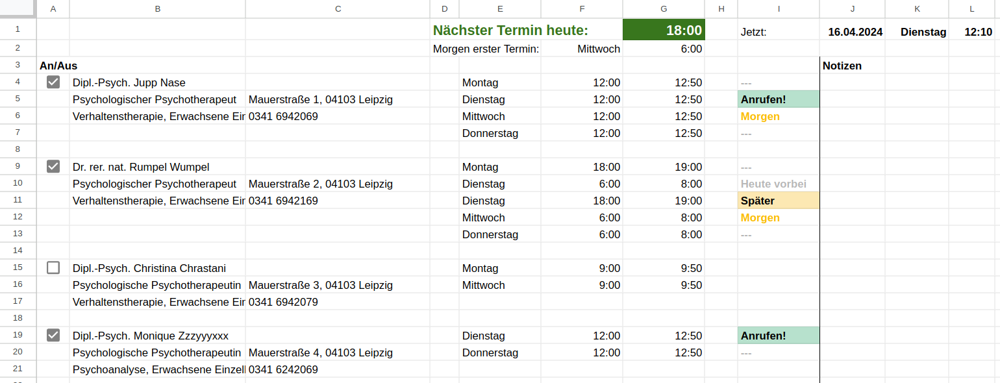

# Sachsenpsych soll der helfen, endlich ein paar Psychotherapeut:innen anzurufen

## Idee

Psychotherapeut:innen sind je nach Art ihres Sitzes verpflichtet, 100 oder 200 min pro Woche telefonisch erreichbar zu sein.
Oft ist diese Telefonzeit auf mehrere Tage aufgeteilt und im Blick zu halten, wann wo angerufen werden soll ist nicht leicht.
Dieses Tool soll dir dabei helfen, ein übersichtliches Spreadsheet zu erzeugen und deinen Namen endlich auf ein paar
Wartelisten zu setzen.

## Wie es funktioniert

### Psych.pdf-Dateien generieren
 
1. Gehe zur [Suchmaske der Kassenärztlichen Vereinigung Sachsen](https://frigg.kvs-sachsen.de/arztsuche/)
1. Wähle unter _Fachkriterien_ 'Psychotherapeut'
1. Wähle unter _Fachgebiet/Schwerpunk_ einen Schwerpunkt (zB 'Psychologische Psychotherapie')
1. Gib unter _PLZ_ eine Postleitzahl in deiner Umgebung ein.
    1. Die Suche spuckt keine Ergebnisse aus falls es mehr als 100 Ergebnisse gibt. Deswegen schränken wir die Ergebnisliste passend ein.
    1. Leg dir am Besten eine Liste von PLZs in deiner Gegend heraus damit du sie nacheinander in die Suchmaske füttern kannst
1. _Arztsuche starten >>_
1. Klicke oben auf den Tab Liste
1. Gehe alle Ergebnisseiten durch und setze bei jedem Eintrag links das Häkchen
1. Klicke unten auf _Auswahl drucken_ und speichere die pdf unter einem Namen der mit 'Detailansicht' beginnt
1. Wiederhole Schritt 4 – 8 mit allen für dich erreichbaren Postleitzahlen

### pdf in csv umwandeln

1. Lade die Datei _read_pdf.py_ aus diesem Repository herunter und lege sie im gleichen Ordner wie die pdf-Dateien ab.
1. Führe das Python-Skript aus. Es generiert aus den pdf-Dateien eine Detailansicht.csv
    1. Eventuell musst du vorher noch das modul pypdf installieren
    1. Falls du mit dem Ausführen von Python-Skripten noch keine Erfahrung hast musst du dir an dieser Stelle leider etwas Hilfe suchen..

### csv in Spreadsheet importieren

1. Öffne das [Template](https://docs.google.com/spreadsheets/d/1SUOJ-7U9_gVqb5uYxE79DaZ4zZvCvxb3-sZ1bcu5wRk)
1. Erstelle dir eine Kopie (_Datei_ &rarr; _Kopie erstellen_) und öffne sie
1. Klicke in das grüne Feld A4
1. Klicke auf _Datei_ &rarr; _Importieren_ und lade unter _Hochladen_ die Datei Detailansicht.csv hoch
1. Wähle im linken Dropdown die Option _Daten an der ausgewählten Zelle ersetzen_ und klicke auf _Daten importieren_
1. Optional:
    1. Da man bei Google Sheets keine Checkboxen importieren kann habe ich dafür ein Skript hinterlegt. Du findest es oben unter _Custom Menu_ &rarr; _Add Checkboxes_
    1. Google wird dich ein paar mal Fragen, ob du wirklich fremde Skripts ausführen willst. Solltest du das nicht wollen kannst du
        1. Händisch in alle Felder der Spalte A eine Checkbox einfügen. Markiere sie dazu mit Strg und klicke unter _Einfügen_ auf _Kästchen_.
        1. Oder einfach nichts tun. Falls du eine Praxis deaktivieren möchtest z.B. weil du sie schon erreicht hast tausche das `TRUE` einfach durch ein `FALSE` aus.

## Was es tut

- In den Spalten B und C befinden sich die Infos über die Praxis
    - Name
    - Adresse
    - Telefonnummer
    - Fachgebiet
    - Angebotene Leistungen
- In den Spalten E – G sind die Tage und die Telefonzeiten an 
- ⭐️⭐️⭐️ __In Spalte I siehst du, wo du heute, morgen oder sogar grade jetzt anrufen kannst__ ⭐️⭐️⭐️
- In den Felder G1 und G2 siehst du außerdem noch, wann heute die nächste Telefonzeit beginnt und wann __morgen__ dein erster Anruf ist
- Solltest du eine Praxis erreicht haben kannst du dir in Spalte J eine Notiz machen und in Spalte die Checkbox deaktivieren (oder `FALSE` reinschreiben) um die Anrufzeiten zu deaktivieren

## 🐥

Ich hoffe, dir bei der Suche nach Psychotherpaie zumindest ein kleines bisschen geholfen zu haben.  
Der Weg ist schwer aber du musst ihn nicht alleine gehen <3